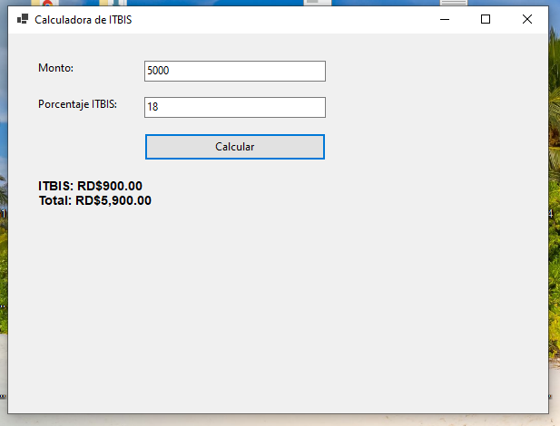

# Calculadora de ITBIS

Aplicación de escritorio desarrollada en Windows Forms con C# para calcular el Impuesto sobre Transferencias de Bienes Industrializados y Servicios (ITBIS) en República Dominicana.

## Funcionalidades

- Entrada de monto base
- Configuración del porcentaje de ITBIS (18% por defecto)
- Cálculo automático del impuesto
- Visualización del total con formato de moneda RD$
- Validación de datos numéricos
- Manejo de errores con mensajes claros

## Captura de Pantalla



## Requisitos

- .NET SDK 6.0 o superior
- Windows OS

## Instalación y Ejecución

1. Clona este repositorio:

```bash
git clone https://github.com/erickson0750/CalculadoraITBIS.git
```

2. Navega a la carpeta del proyecto:

```bash
cd CalculadoraITBIS
```

3. Ejecuta la aplicación:

```bash
dotnet run
```

## Tecnologías Utilizadas

- C#
- .NET 8.0
- Windows Forms

## Autor

Erickson Cayetano Paredes - Proyecto desarrollado como parte de la materia de Programación 1
